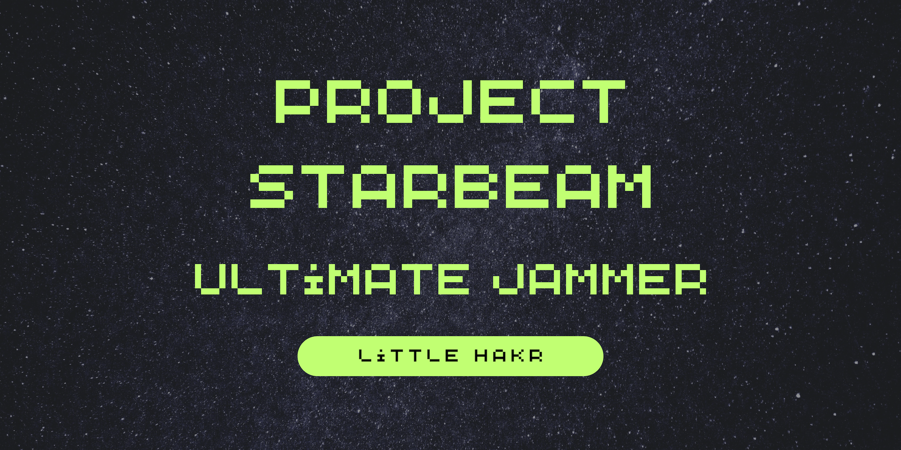
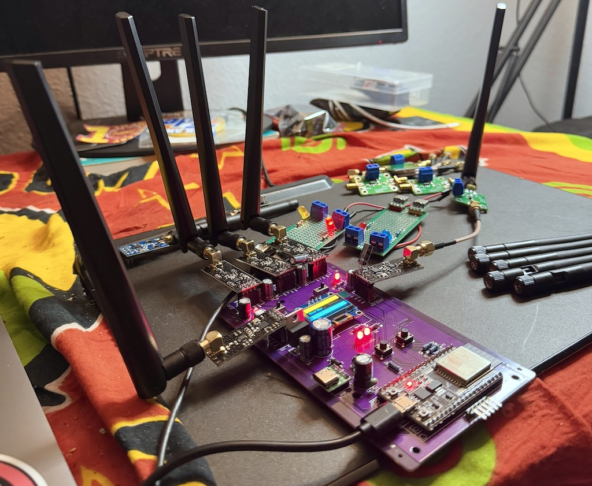
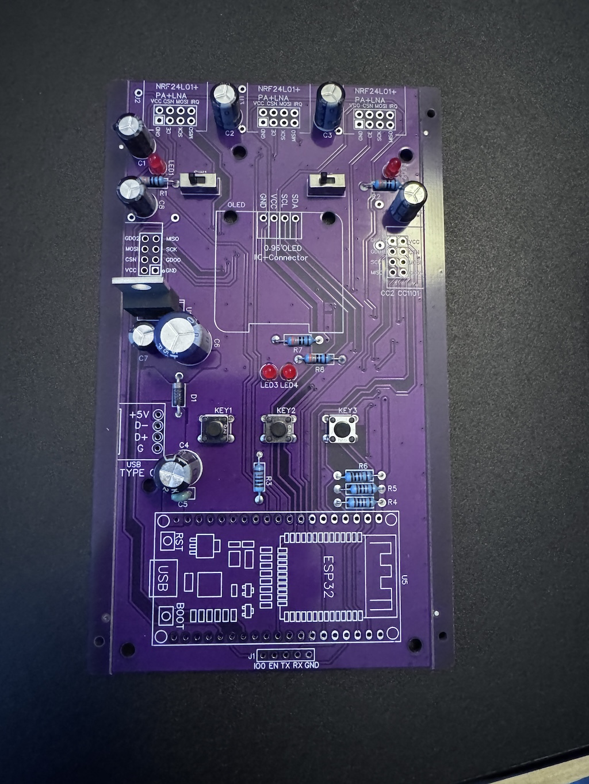
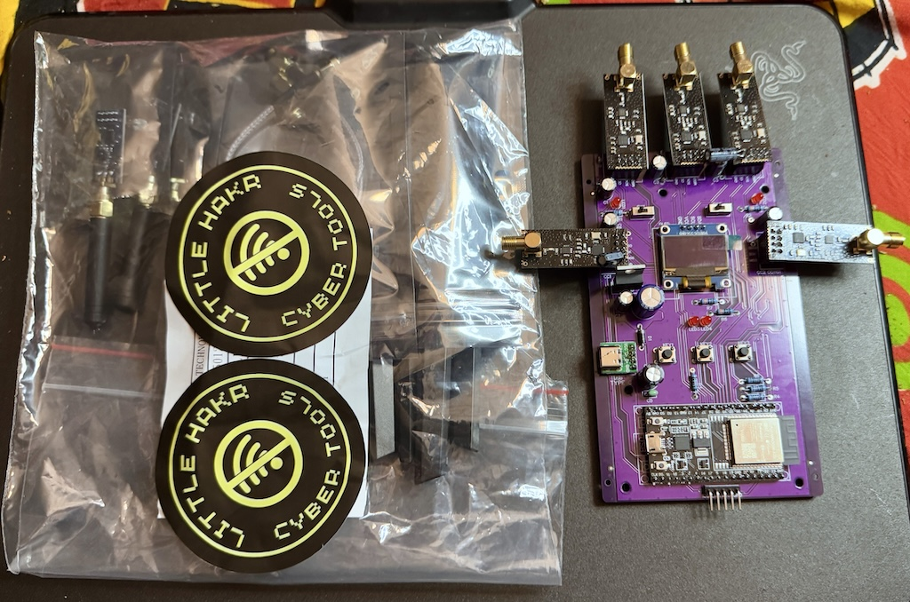
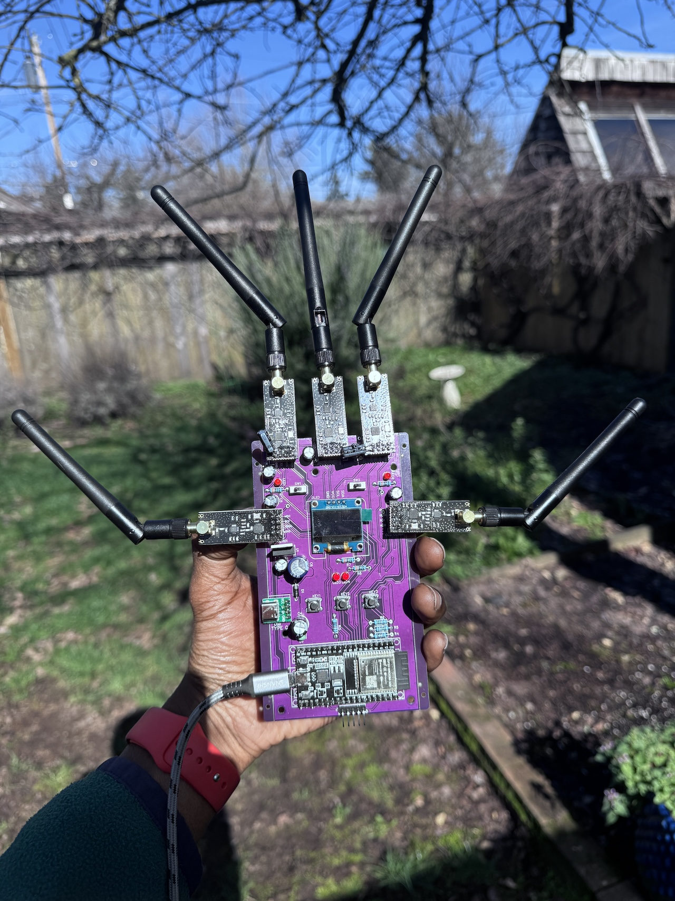
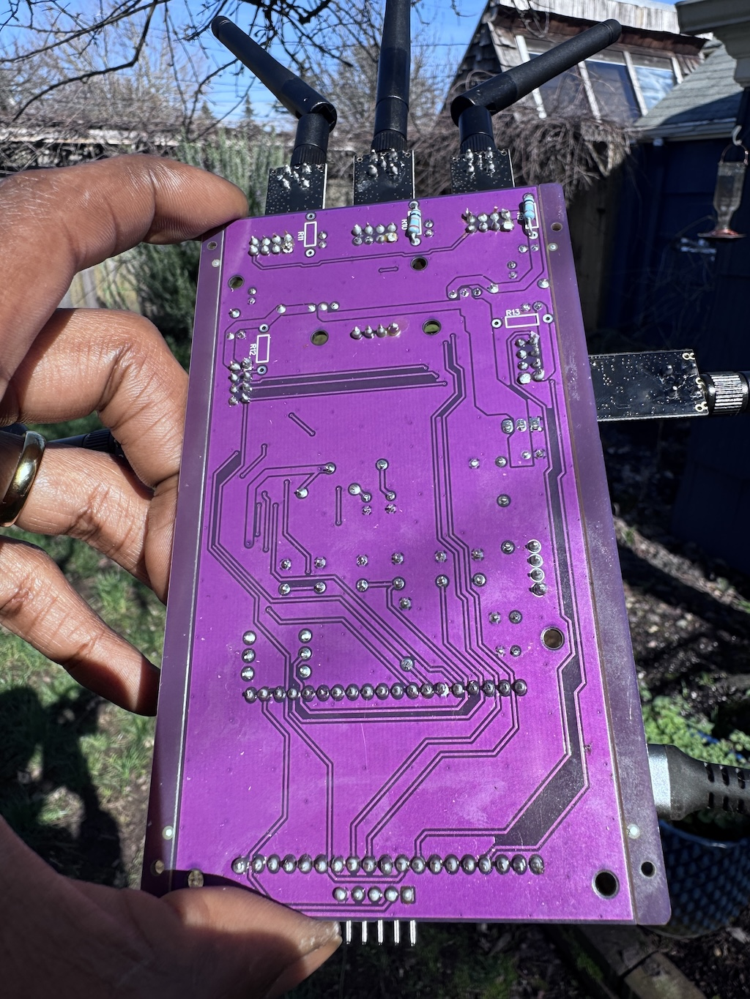
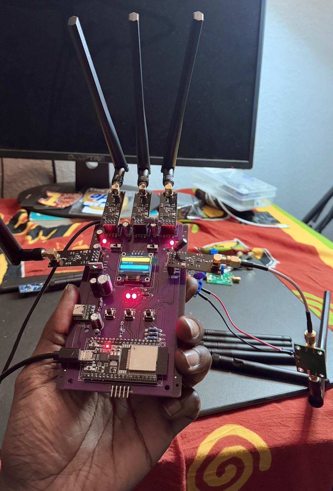
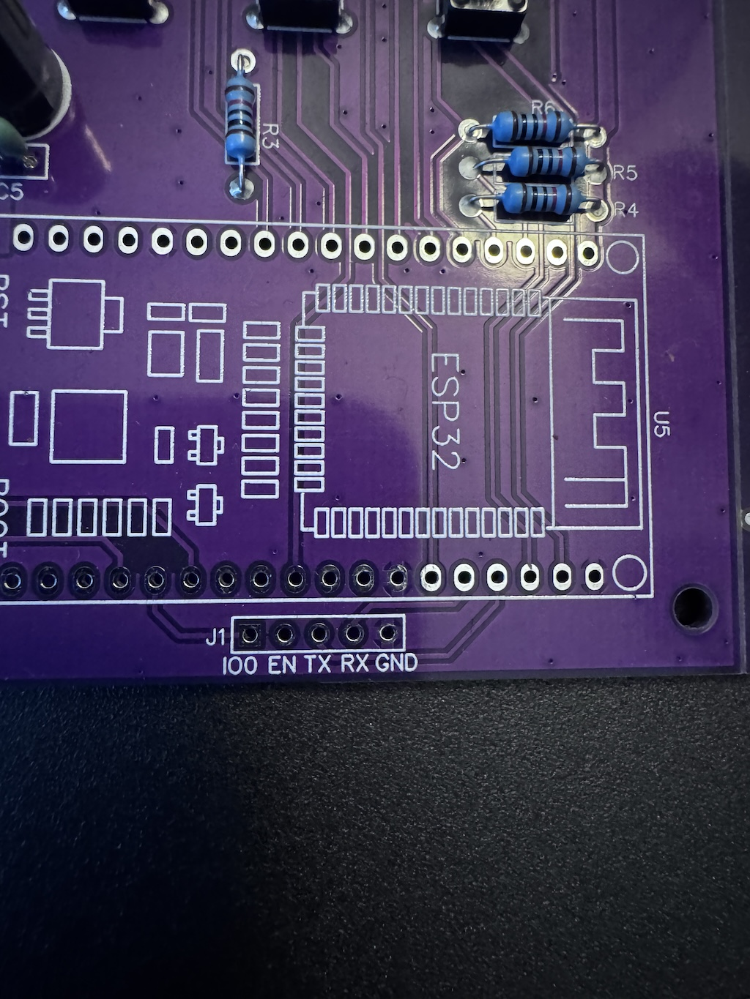
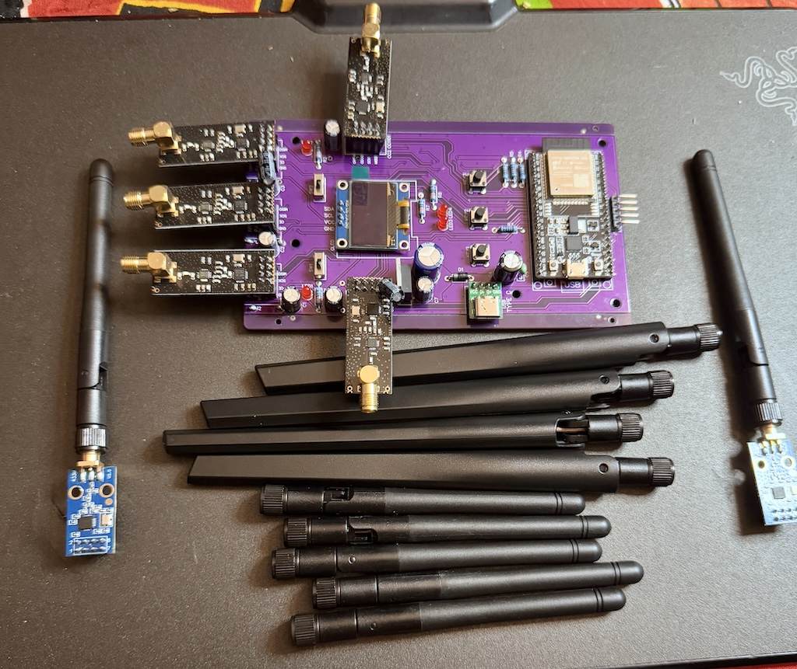

# project starbeam
**The Ultimate ESP32 WiFi + BT + Drone Jammer w/ 5 Radios.**

  
## Project Starbeam: An Affordable Approach to Signal Intelligence for Security Applications

Project Starbeam is an innovative signal intelligence platform leveraging cost-effective, open-source hardware to deliver advanced capabilities in signal analysis, generation, and manipulation. Central to its design is a custom PCB incorporating the ESP32-WROOM-32D microcontroller alongside multiple radio frequency modules. The system's modularity and compatibility with devices like HackRF One extend its frequency coverage up to 6 GHz, making it a versatile tool for various applications in security testing and operations.  
  
## Starbeam PCB Assembly Guide
This guide provides instructions for completing the Starbeam PCB assembly after the
components have been manufactured and attached. You can source the necessary parts from
various suppliers, but the provided links offer decent price points. It is crucial to obtain the
exact specified parts if using this PCB, especially for the display and USB-C module.
This is what you will get after PCB order:
  

### PCB-A Notes:
**This is a 4-layer PCB, there are notes for the required specifications in /hardwawre**
**This is an advanced project, so please do not waste your time & money if you do not understand PCB ordering, & if you need any assistance you can book a call & i'll be more than happy to walk you through the whole build process:
[Book a 30 Minute Consultation](https://book.stripe.com/cN2eWneWf77F4gM5kq)**

Link to PCB to place order:
https://pcbway.com/g/87Pi52

**Required Components After PCB Assembly:**
- **ESP32-Wroom-32D**:
    - https://amzn.to/3YR1noR
- **SSD1306 128x64 0.96-inch Display**:
    - https://amzn.to/4lONdP9
- **NRF24 Radios (x5) for 2.4GHz**:
    - https://amzn.to/4iBofjl
- **CC1101 Radios (x2) for 433MHz**:
    - https://amzn.to/4iuopZH
- **USB-C Module**:
    - https://amzn.to/4lKZ5BL

**Software Setup & Code Upload:**
1. Download Arduino IDE:
    - Get it here: https://www.arduino.cc/en/software/
2. Install Arduino IDE:
    - Refer to the installation guide:
    - https://docs.arduino.cc/software/ide-v2/tutorials/getting-started/ide-v2-downloading-and-installing/
3. Open the Code:
    - Extract the starbeam code .zip file.
    - **Extract SmartRC-CC1101-Driver-Lib2 2.zip & add it to your Documents/Adruino/libraries/ folder. This must be added to use the 2nd CC1101 radio module!**
    - If you are creative, you can also add up to 5 CC1101's for advanced testing.
    - Open the starbeam .ino file. This will automatically open the code in Arduino IDE.
4. Upload Code to ESP32:
    - Upload the code to your ESP32 microcontroller using Arduino IDE. 
    -   Note: Videos on uploading code and using Arduino IDE are available in the Hakr Hardware Club (https://whop.com/little-hakr).
5. Final Steps:
    - Attach the antennas that correspond to your desired setup.
    - Good luck...
  
  
   
    

## System Architecture
**ESP32-WROOM-32D Microcontroller**
At the core of Project Starbeam is the ESP32-WROOM-32D, a powerful Wi-Fi and Bluetooth combination module designed for a wide range of applications. Key features include:  
* Dual-core 32-bit processor with adjustable clock frequency (80 MHz to 240 MHz)   
* 4 MB of embedded flash memory   
* Integrated 2.4 GHz Wi-Fi and Bluetooth capabilities   
* Multiple GPIOs for peripheral interfacing   
These specifications make the ESP32-WROOM-32D suitable for handling complex signal processing tasks efficiently.  

**Radio Frequency Modules**
The platform's design allows for configurable RF modules, enhancing its versatility:  
**Left Switch - Top 3 radios**
**Right Switch - 2 Side radios**

* **Configuration A**:  Five NRF24L01+PA+LNA modules   
* **Configuration B**: Three NRF24L01+PA+LNA modules combined with two CC1101 modules 
* **Configuration C?**:  Five CC1101 modules   
  
This modularity enables tailored configurations to meet specific operational requirements, facilitating tasks such as frequency scanning and signal generation.  

**HackRF One Integration**
To extend the system's frequency range, Project Starbeam integrates with HackRF One, an open-source software-defined radio (SDR) peripheral capable of transmitting and receiving signals from 1 MHz to 6 GHz. It connects to a raspberry pi via the TX/RX pins at the bottom. This integration significantly broadens the platform's capabilities, allowing for comprehensive signal analysis across a wide spectrum. 

 

## Key Features
* Digital Signal Generation: Users can create custom RF signals for testing and simulation purposes.   
* Frequency Scanning: The system can detect and analyze RF signals across multiple bands, aiding in spectrum monitoring.   
* Signal Copying & Replay: It captures and reproduces signals, facilitating analysis and testing scenarios.   
* Modular Design: The hardware setup is configurable, allowing adaptation to various operational needs.   
* Extended Range: With HackRF compatibility, the platform's frequency coverage extends up to 6 GHz.   
* Open-Source Architecture: The design promotes customization and expansion, fostering continuous development.   
Applications
* Tactical Operations: Project Starbeam serves as a valuable tool in secure communications testing, unauthorized transmission detection, counter-surveillance, and communications security assessments for tactical teams.   
* Border Security: The platform aids in detecting unauthorized communication devices, analyzing suspicious signal activities, identifying signal-based threats, and monitoring restricted frequencies in sensitive areas.   
* Critical Infrastructure Protection: It facilitates vulnerability assessments of wireless systems, detection of potential signal-based attacks, security testing of IoT deployments, and identification of rogue devices on secure networks.   
* Training and Simulation: As a cost-effective platform, Project Starbeam supports signal intelligence training, simulation of various RF threat scenarios, hands-on training for technical personnel, and development of countermeasures against signal-based threats.   
* Forensic Investigations: The system assists in analyzing RF evidence, signal pattern matching for forensic purposes, documentation of unauthorized transmissions, and reconstruction of communications timelines.   
  
### Technical Specifications
* **Microcontroller:** ESP32-WROOM-32D   
* **RF Modules:**   
    * Configuration A: 5x NRF24L01+PA+LNA   
    * Configuration B: 3x NRF24L01+PA+LNA and 2x CC1101   
* **Extended Frequency Range:** Up to 6 GHz (with HackRF One)   
* **Power: Specifications:** micro-USB & USB-C for 5V  
* **Connectivity:** Wi-Fi, Bluetooth, Serial   
**Future Expansion**
The platform's open architecture allows for numerous potential expansions, including integration with additional sensor types, implementation of machine learning for signal classification, development of specialized modules for particular frequency bands, creation of distributed sensor networks, addition of advanced encryption capabilities, integration with existing security infrastructure, and development of custom analysis software for specific needs.  

  

## Projekt StarBeam 2.0
**Version 2 is being manufactured... 10 NRFs, 2 ESP32's & a BW16.**
- **cypher**
- **little hakr**
